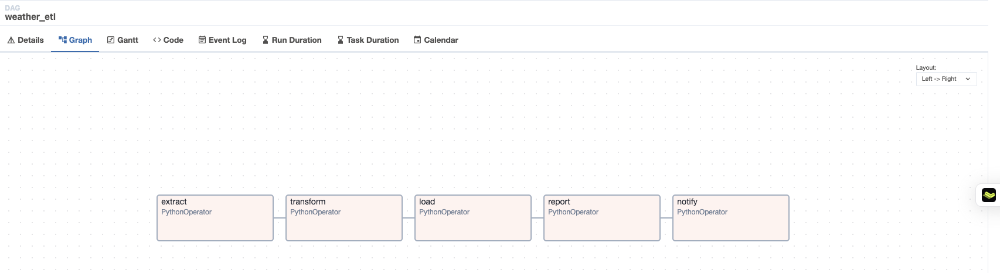
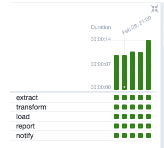
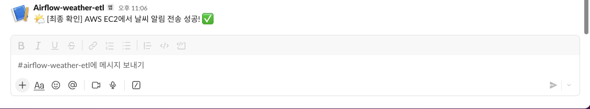
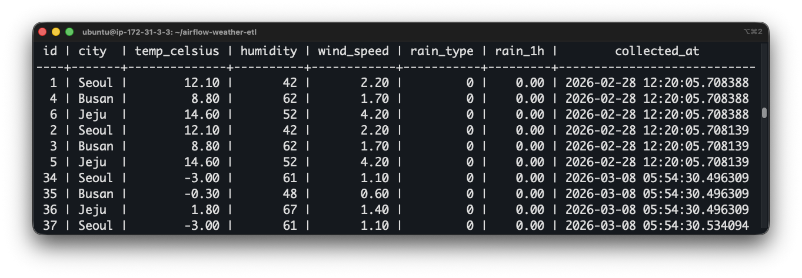

# 🌤️ Airflow Weather ETL

> **Korean Meteorological Administration(KMA) API**를 활용한 실시간 기상 데이터 수집·저장·분석 파이프라인

<p align="center">
  
  
  
  
</p>

<p align="center">
  
  
  
  
</p>

<p align="center">
  
  &nbsp;
  
  &nbsp;
  
</p>

---

## 📸 스크린샷

<table>
  <tr>
    <td align="center"><b>Airflow DAG Graph View</b></td>
    <td align="center"><b>Airflow DAG Grid View</b></td>
  </tr>
  <tr>
    <td>
      
      <!-- 📌 TODO: DAG Graph 스크린샷 추가 (localhost:8080) -->
    </td>
    <td>
      
      <!-- 📌 TODO: DAG Grid 스크린샷 추가 -->
    </td>
  </tr>
  <tr>
    <td align="center"><b>Slack 알림</b></td>
    <td align="center"><b>PostgreSQL 수집 데이터</b></td>
  </tr>
  <tr>
    <td>
      
      <!-- 📌 TODO: Slack 알림 스크린샷 추가 -->
    </td>
    <td>
      
      <!-- 📌 TODO: PostgreSQL 쿼리 결과 스크린샷 추가 -->
    </td>
  </tr>
</table>

---

## 🗺️ 아키텍처 설계도

```
┌─────────────────────────────────────────────────────────────────────────┐
│                          DATA SOURCE                                     │
│                                                                          │
│   ┌─────────────────────────────────────────────────────────────────┐   │
│   │         기상청 단기예보 API (Korean Met. Admin.)                  │   │
│   │    Seoul (60,127) · Busan (98,76) · Jeju (52,38)               │   │
│   └─────────────────────────┬───────────────────────────────────────┘   │
└─────────────────────────────┼───────────────────────────────────────────┘
                              │  HTTP GET / Hourly
                              ▼
┌─────────────────────────────────────────────────────────────────────────┐
│                      DOCKER COMPOSE STACK                                │
│                                                                          │
│  ┌──────────────────────────────────────────────────────────────────┐   │
│  │                  Apache Airflow 2.10.4                            │   │
│  │                                                                   │   │
│  │   ┌────────────┐    ┌────────────┐    ┌──────────┐               │   │
│  │   │  Webserver │    │  Scheduler │    │  Init DB │               │   │
│  │   │ :8080      │    │ (LocalExec)│    │ (one-off)│               │   │
│  │   └────────────┘    └─────┬──────┘    └──────────┘               │   │
│  │                           │                                       │   │
│  │               ┌───────────▼────────────────────────┐             │   │
│  │               │         DAG: weather_etl            │             │   │
│  │               │  Schedule: @hourly  Catchup: False  │             │   │
│  │               │                                     │             │   │
│  │               │  ① extract ──▶ ② transform          │             │   │
│  │               │       ──▶ ③ load ──▶ ④ report       │             │   │
│  │               │              ──▶ ⑤ notify           │             │   │
│  │               └───────────────────────────────────┬─┘             │   │
│  └──────────────────────────────────────────────────┼───────────────┘   │
│                                                      │                   │
│  ┌──────────────────────────────┐                    │                   │
│  │       PostgreSQL 15          │◀───────────────────┘                   │
│  │  ┌─────────────────────┐     │   INSERT / UPSERT                      │
│  │  │  weather_raw        │     │                                        │
│  │  │  (hourly records)   │     │                                        │
│  │  ├─────────────────────┤     │                                        │
│  │  │  weather_daily_stats│     │                                        │
│  │  │  (daily aggregates) │     │                                        │
│  │  └─────────────────────┘     │                                        │
│  └──────────────────────────────┘                                        │
└─────────────────────────────────────────────────────────────────────────┘
                              │  ⑤ notify
                              ▼
                    ┌─────────────────┐
                    │   Slack Webhook │
                    │  (optional)     │
                    └─────────────────┘

┌─────────────────────────────────────────────────────────────────────────┐
│                          CI / CD PIPELINE                                │
│                                                                          │
│  Push / PR ──▶ GitHub Actions CI                                        │
│                  ├─ DAG import validation (DagBag)                      │
│                  └─ pytest (4 unit tests)                                │
│                                                                          │
│  Manual trigger ──▶ GitHub Actions CD                                   │
│                       ├─ SSH into AWS EC2                               │
│                       ├─ git pull origin main                           │
│                       └─ docker compose restart                         │
└─────────────────────────────────────────────────────────────────────────┘
```

---

## ⚙️ ETL 파이프라인 상세

| 단계 | Task ID | 역할 | 비고 |
|:---:|---------|------|------|
| ① | `extract` | KMA API 호출 → raw JSON 수집 | XCom으로 전달 |
| ② | `transform` | 카테고리별 응답 파싱 → 구조화 | 온도·습도·풍속·강수 |
| ③ | `load` | `weather_raw` 테이블 INSERT | 도시별 1행 |
| ④ | `report` | 일별 통계 집계 → UPSERT | avg/max/min temp, avg humidity |
| ⑤ | `notify` | Slack 알림 발송 | SLACK_WEBHOOK_URL 미설정 시 skip |

---

## 🗄️ 데이터베이스 스키마

```sql
-- 시간별 원시 데이터
CREATE TABLE weather_raw (
    id           SERIAL PRIMARY KEY,
    city         VARCHAR(100),
    temp_celsius NUMERIC(5,2),    -- 기온 (℃)
    humidity     INTEGER,          -- 습도 (%)
    wind_speed   NUMERIC(5,2),    -- 풍속 (m/s)
    rain_type    INTEGER,          -- 0=없음, 1=비, 2=비+눈, 3=눈
    rain_1h      NUMERIC(5,2),    -- 1시간 강수량 (mm)
    collected_at TIMESTAMP DEFAULT NOW()
);

-- 일별 통계 집계
CREATE TABLE weather_daily_stats (
    id           SERIAL PRIMARY KEY,
    city         VARCHAR(100),
    stat_date    DATE,
    avg_temp     NUMERIC(5,2),
    max_temp     NUMERIC(5,2),
    min_temp     NUMERIC(5,2),
    avg_humidity INTEGER,
    created_at   TIMESTAMP DEFAULT NOW(),
    UNIQUE (city, stat_date)      -- upsert 기준
);
```

---

## 🚀 빠른 시작

### 사전 요구사항

- Docker & Docker Compose
- 기상청 API 키 ([공공데이터포털](https://www.data.go.kr) 발급)

### 1. 저장소 클론

```bash
git clone https://github.com/seSAC/airflow-weather-etl.git
cd airflow-weather-etl
```

### 2. 환경 변수 설정

```bash
cp .env.example .env
# .env 파일을 열어 아래 값을 설정:
# OPENWEATHER_API_KEY=your_kma_api_key_here
# SLACK_WEBHOOK_URL=https://hooks.slack.com/... (선택사항)
# AIRFLOW_UID=50000
```

### 3. 컨테이너 실행

```bash
# UID 설정 (Linux 환경)
echo -e "AIRFLOW_UID=$(id -u)" >> .env

# 초기화 및 실행
docker compose up airflow-init
docker compose up -d
```

### 4. Airflow UI 접속

```
URL:      http://localhost:8080
Username: admin
Password: admin
```

DAG 목록에서 **`weather_etl`** 을 활성화(toggle ON)하면 매 시간 자동 실행됩니다.

---

## 🧪 테스트

```bash
# 의존성 설치
pip install apache-airflow==2.10.4 pytest psycopg2-binary requests

# 테스트 실행
pytest tests/ -v
```

| 테스트 | 검증 항목 |
|--------|-----------|
| `test_no_import_errors` | DAG 파일 문법 오류 없음 |
| `test_dag_exists` | `weather_etl` DAG 등록 확인 |
| `test_task_count` | 태스크 5개 존재 확인 |
| `test_task_order` | `extract → transform` 순서 확인 |

---

## 📁 프로젝트 구조

```
airflow-weather-etl/
├── dags/
│   ├── weather_etl_dag.py       # 메인 ETL DAG (5 tasks)
│   └── utils/
├── tests/
│   └── test_dag.py              # pytest 단위 테스트
├── sql/
│   └── create_tables.sql        # DB 스키마 초기화
├── plugins/                     # Airflow 플러그인 (확장용)
├── logs/                        # 실행 로그
├── docs/
│   └── screenshots/             # README 스크린샷
├── .github/
│   └── workflows/
│       ├── ci.yml               # 자동 테스트 (Push/PR)
│       └── cd.yml               # 수동 배포 (EC2)
├── docker-compose.yaml
└── .env                         # API 키 (git 제외)
```

---

## 🔧 기술 스택

| 분류 | 기술 |
|------|------|
| **워크플로우 오케스트레이션** | Apache Airflow 2.10.4 |
| **언어** | Python 3.12 |
| **데이터베이스** | PostgreSQL 15 |
| **컨테이너** | Docker Compose |
| **CI** | GitHub Actions |
| **CD (대상)** | AWS EC2 |
| **알림** | Slack Incoming Webhook |
| **데이터 소스** | 기상청 단기예보 API v2.0 |

---

## 📊 수집 도시

| 도시 | X 격자 | Y 격자 |
|------|--------|--------|
| 서울 | 60 | 127 |
| 부산 | 98 | 76 |
| 제주 | 52 | 38 |

---

## 📝 라이선스

MIT License © 2026
